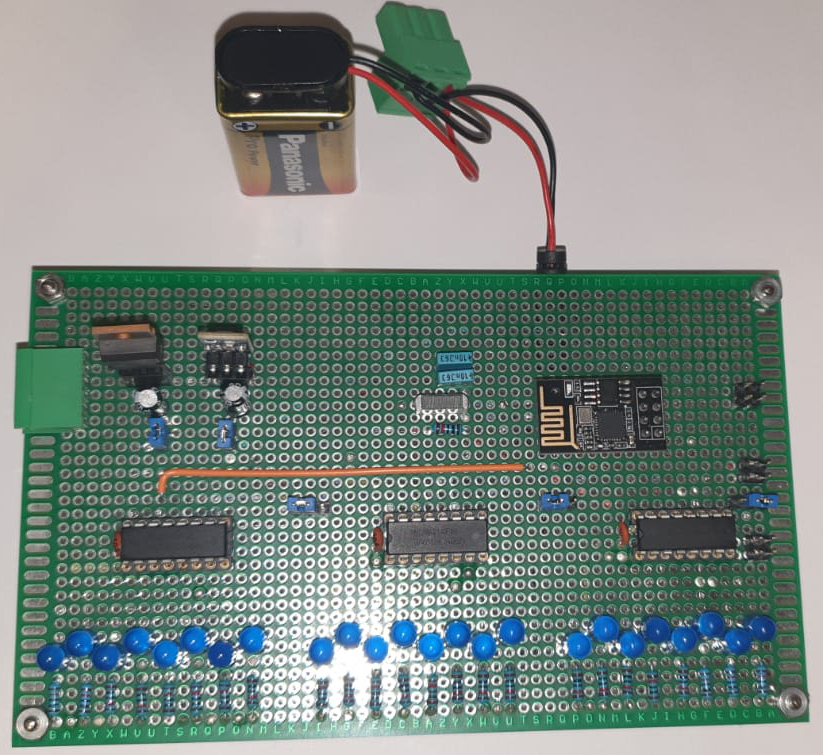

# ESP PinOut Expander

Este proyecto maximiza la capacidad de salida del microcontrolador ESP8266 ESP01, usando registros de desplazamiento 74HC595 para expandir 3 pines a el número de salidas digitales que necesite. Sin recurrir a SPI o I2C, emplea 3 pines para señales de clock, data y latch, y viene con una librería C++ sencilla.

## Tabla de Contenidos
- [Introducción](#introducción)
- [Características](#características)
- [Requisitos](#requisitos)
- [Definición del ejemplo de prueba](#definición-del-ejemplo-de-prueba)
- [Material que necesitamos](#material-que-necesitamos)
- [Diagrama de Conexiones](#diagrama-de-conexiones)
- [Prototipo finalizado](#prototipo-finalizado)
- [Librería C++](#librería-c)
- [Ejemplos](#ejemplos)
- [Contribuciones](#contribuciones)
- [Licencia](#licencia)
- [Referencias](#referencias)

## Introducción
Este proyecto utiliza un ESP8266-ESP01 y múltiples registros de desplazamiento 74HC595 para expandir las salidas digitales disponibles, permitiendo controlar un mayor número de dispositivos con un número limitado de pines.

## Características
- Expansión de salidas digitales.
- Control bit a bit de las salidas.
- Fácilmente ampliable.

## Requisitos
- ESP8266-ESP01


- Registros de desplazamiento 74HC595


- Fuente de alimentación de 3,3v
- Cableado y conectores
- Software de programación (Arduino IDE, por ejemplo)

## Definición del ejemplo de prueba
Para la prueba vamos a establecer que necesitamos 24 bit de salida, y en nuestro caso utilizaremos leds, para poder visualizar los cambios de estado.

## Material que necesitamos
1. 1 x ESP8266-ESP01
2. 1 x Condensador electrolítico de 10 uF (10v)
3. 3 x 74HC595
4. 4 x Condensador de 100nf
5. 25 x Resistencia 10k ohms
6. 24 x Led 5mm Azul (o el color que prefieras)
7. Placa PCB perforada (recomendable usar placas de una sola cara)
8. Cable wire wrap
9. 1 x Fuente de alimentación de 3,3v y 1A

## Diagrama de Conexiones
(Aquí puedes incluir un diagrama o una descripción detallada de las conexiones necesarias)

## Prototipo finalizado
El prototipo finalizado muestra el circuito completo con el ESP8266-ESP01 y los registros de desplazamiento 74HC595 conectados en una placa PCB perforada. En esta configuración, todos los componentes necesarios están ensamblados y el circuito está listo para ser utilizado.




## Librería C++
La librería `ttl74595.h` proporciona una serie de métodos estáticos para controlar los registros de desplazamiento 74HC595. A continuación se describen los métodos públicos disponibles:

### Métodos Públicos

- `static void Instanciar();`
  - **Descripción**: Inicializa la instancia de la librería. Este método debe ser llamado antes de usar cualquier otro método de la librería.

- `static void Inicializar(uint8_t num);`
  - **Descripción**: Inicializa el registro de desplazamiento con el número especificado.
  - **Parámetros**:
    - `num` - El número de registros de desplazamiento a inicializar.

- `static void SetAllOn();`
  - **Descripción**: Establece todos los bits del registro de desplazamiento a ON (1).

- `static void SetAllOff();`
  - **Descripción**: Establece todos los bits del registro de desplazamiento a OFF (0).

- `static void SetBit(int numBit, bool valorBit);`
  - **Descripción**: Establece el valor de un bit específico en el registro de desplazamiento.
  - **Parámetros**:
    - `numBit` - El número del bit que se va a establecer.
    - `valorBit` - El valor del bit (`true` para ON, `false` para OFF).

- `static String GetRegisters();`
  - **Descripción**: Devuelve el estado actual de los registros de desplazamiento en formato hexadecimal.
  - **Retorno**: Una cadena (`String`) que representa el estado actual de los registros de desplazamiento.

Estos métodos proporcionan un control completo sobre los registros de desplazamiento 74HC595, permitiendo la manipulación individual de los bits así como el control de todos los bits simultáneamente.

## Ejemplos
```cpp
// Ejemplo de código para controlar las salidas
// Código Arduino para manejar los registros de desplazamiento
```

## Contribuciones
¡Gracias por tu interés en contribuir a este proyecto! Aquí tienes algunas maneras en las que puedes ayudar:

1. **Reportar problemas**
    - Si encuentras un error o tienes una sugerencia, por favor abre un issue en GitHub.
    - Proporciona tanta información como sea posible (ejemplo de código, mensajes de error, etc.).

2. **Discusiones y sugerencias**
    - Participa en las discusiones de los issues existentes para compartir tus ideas y sugerencias.
    - Propón nuevas ideas o mejoras en la sección de issues de GitHub.
    - Usa las etiquetas correspondientes para categorizar tus issues (ej. `sugerencia`, `error`, `pregunta`).

3. **Mejorar la documentación**
    - Si tienes sugerencias para mejorar la documentación, abre un issue describiendo los cambios propuestos.
    - Los mantenedores del proyecto revisarán tus sugerencias y realizarán las modificaciones necesarias.

4. **Código de Conducta**
    - Sé respetuoso y considerado en todas tus interacciones.
    - Sigue el Código de Conducta del proyecto.

Estamos emocionados de ver tus contribuciones. ¡Gracias por ayudarnos a mejorar!

## Código de Conducta
Este proyecto sigue el Código de Conducta para fomentar un entorno de colaboración positivo y respetuoso. Por favor, revisa el [Código de Conducta](CODE_OF_CONDUCT.md) antes de participar.

## Licencia
Este proyecto está licenciado bajo la Licencia MIT. Para más detalles, consulta el archivo LICENSE en este repositorio. Eres libre de utilizar, modificar y distribuir este software, siempre que se incluya una mención adecuada a los autores originales.

## Referencias

Imagen del ESP8266 esp01 de Az-Delivery, obtenida de la página del producto en Amazon. Fuente: Az-Delivery, disponible en https://www.az-delivery.de.
