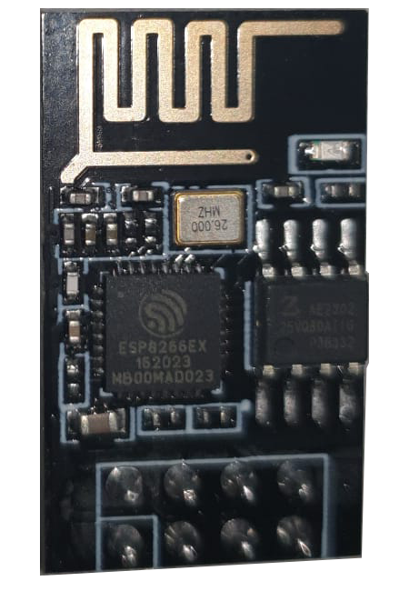

# ESP-PinOut-Expander

Este proyecto maximiza la capacidad de salida del microcontrolador ESP8266 ESP01, usando registros de desplazamiento 74HC595 para expandir 4 pines a el número de salidas digitales que necesite. Sin recurrir a SPI o I2C, emplea 3 pines para señales de clock, data y latch, y viene con una librería C++ sencilla.

## Tabla de Contenidos
- [Introducción](#introducción)
- [Características](#características)
- [Requisitos](#requisitos)
- [Instalación](#instalación)
- [Uso](#uso)
- [Diagrama de Conexiones](#diagrama-de-conexiones)
- [Ejemplos](#ejemplos)
- [Contribuciones](#contribuciones)
- [Licencia](#licencia)

## Introducción
Este proyecto utiliza un 8266 ESP01 y múltiples registros de desplazamiento 74HC595 para expandir las salidas digitales disponibles, permitiendo controlar un mayor número de dispositivos con un número limitado de pines.

## Características
- Expansión de salidas digitales.
- Control bit a bit de las salidas.
- Fácilmente ampliable.

## Requisitos
- 8266 ESP01
  
  
  
- Registros de desplazamiento 74HC595
- Fuente de alimentación de 3,3v
- Cableado y conectores
- Software de programación (Arduino IDE, por ejemplo)

## Definición del ejemplo de prueba
Va la prueba vamos a establecer que necesitamos 24 bit de salida, y en nuestro caso utilizaremos leds, para poder demostrar de forma visual su uso.

## Material que necesitamos
1. 8266 ESP01
2. Instala el Arduino IDE (si no lo tienes ya instalado).
3. Añade las bibliotecas necesarias al Arduino IDE.
4. Configura el ESP01 en el Arduino IDE.

## Uso
1. Conecta el ESP01 y los registros 74HC595 siguiendo el diagrama de conexiones.
2. Sube el código proporcionado al ESP01.
3. Usa los comandos para controlar las salidas digitales expandidas.

## Diagrama de Conexiones
(Aquí puedes incluir un diagrama o una descripción detallada de las conexiones necesarias)

## Ejemplos
```cpp
// Ejemplo de código para controlar las salidas
// Código Arduino para manejar los registros de desplazamiento
