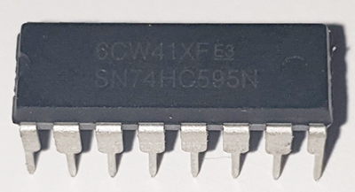

# ESP PinOut Expander

Este proyecto maximiza la capacidad de salida del microcontrolador ESP8266 ESP01, usando registros de desplazamiento 74HC595 para expandir 4 pines a el número de salidas digitales que necesite. Sin recurrir a SPI o I2C, emplea 3 pines para señales de clock, data y latch, y viene con una librería C++ sencilla.

## Tabla de Contenidos
- [Introducción](#introducción)
- [Características](#características)
- [Requisitos](#requisitos)
- [Definición del ejemplo de prueba](#definición-del-ejemplo-de-prueba)
- [Material que necesitamos](#material-que-necesitamos)
- [Diagrama de Conexiones](#diagrama-de-conexiones)
- [Ejemplos](#ejemplos)
- [Contribuciones](#contribuciones)
- [Licencia](#licencia)
- [Referencias](#referencias)

## Introducción
Este proyecto utiliza un ESP8266-ESP01 y múltiples registros de desplazamiento 74HC595 para expandir las salidas digitales disponibles, permitiendo controlar un mayor número de dispositivos con un número limitado de pines.

## Características
- Expansión de salidas digitales.
- Control bit a bit de las salidas.
- Fácilmente ampliable.

## Requisitos
- ESP8266-ESP01


- Registros de desplazamiento 74HC595



- Fuente de alimentación de 3,3v
- Cableado y conectores
- Software de programación (Arduino IDE, por ejemplo)

## Definición del ejemplo de prueba
Para la prueba vamos a establecer que necesitamos 24 bit de salida, y en nuestro caso utilizaremos leds, para poder visualizar los cambios de estado.

## Material que necesitamos
1. 1 x ESP8266-ESP01
2. 1 x Condensador electrolítico de 10 uF (10v)
3. 3 x 74HC595
4. 4 x Condensador de 100nf
5. 25 x Resistencia 10k ohms
6. 24 x Led 5mm Azul (o el color que prefieras)
7. Placa PCB perforada (recomendable usar placas de una sola cara)
8. Cable wire wrap
9. 1 x Fuente de alimentación de 3,3v y 1A

## Diagrama de Conexiones
(Aquí puedes incluir un diagrama o una descripción detallada de las conexiones necesarias)

## Ejemplos
```cpp
// Ejemplo de código para controlar las salidas
// Código Arduino para manejar los registros de desplazamiento
```

## Contribuciones
(Aquí puedes incluir detalles sobre cómo contribuir al proyecto)

## Licencia
Este proyecto está licenciado bajo la Licencia MIT. Para más detalles, consulta el archivo LICENSE en este repositorio. Eres libre de utilizar, modificar y distribuir este software, siempre que se incluya una mención adecuada a los autores originales.

## Referencias

Imagen del ESP8266 esp01 de Az-Delivery, obtenida de la página del producto en Amazon. Fuente: Az-Delivery, disponible en https://www.az-delivery.de.
